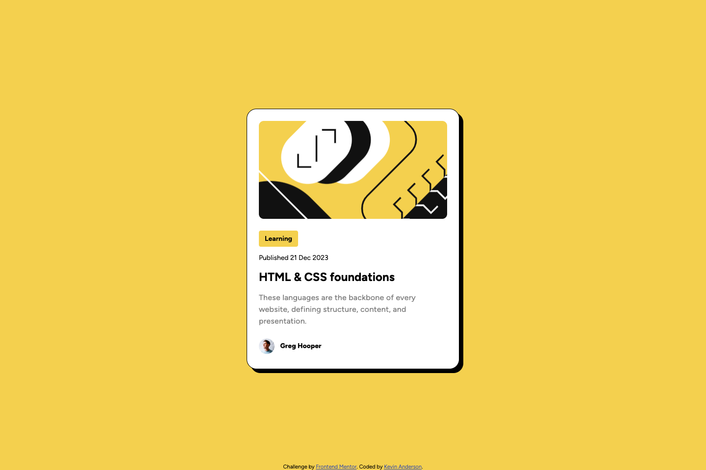

# Frontend Mentor - Blog preview card solution

This is a solution to the [Blog preview card challenge on Frontend Mentor](https://www.frontendmentor.io/challenges/blog-preview-card-ckPaj01IcS). Frontend Mentor challenges help you improve your coding skills by building realistic projects.

## Table of contents

- [Overview](#overview)
  - [The challenge](#the-challenge)
  - [Screenshot](#screenshot)
  - [Links](#links)
- [My process](#my-process)
  - [Built with](#built-with)
  - [What I learned](#what-i-learned)
  - [Continued development](#continued-development)
- [Author](#author)
- [Acknowledgments](#acknowledgments)

## Overview

### The challenge

Users should be able to:

- See hover and focus states for all interactive elements on the page

### Screenshot

### Links

- Solution URL: [https://github.com/kevincanderson/FMLP002_blog-preview-card-main](https://github.com/kevincanderson/FMLP002_blog-preview-card-main)
- Live Site URL: [https://kevincanderson.github.io/FMLP002_blog-preview-card-main/](https://kevincanderson.github.io/FMLP002_blog-preview-card-main/)

## My process

I approached this project as I did the QR Code Component project. Starting with the mobile layout, it came clear that the larger screens had different sizes for fonts, and margin/padding. Once I completed the mobile layout, i moved into the larger screen format. I used flexbox to center the card, as well as line up the author avatar and name.

### Built with

- Semantic HTML5 markup
- CSS custom properties
- Flexbox
- Mobile-first workflow

### What I learned

I learned to pay close attention to different designs. Getting the sizes right.

### Continued development

Continue to hone my skills and reduce overall code. Keep getting projects done!

## Author

- Website - [Kevin Anderson](https://www.kevincanderson.dev)
- Frontend Mentor - [@kevincanderson](https://www.frontendmentor.io/profile/kevincanderson)
- Twitter - [@_andersonkevin_](https://www.twitter.com/_andersonkevin_)

## Acknowledgments

Thanks to Frontend Mentor and the community for being here.
